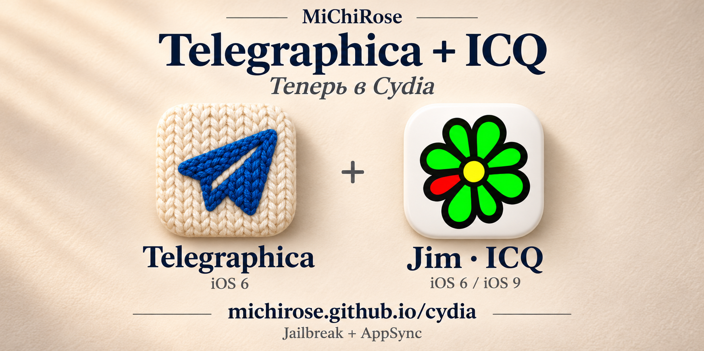
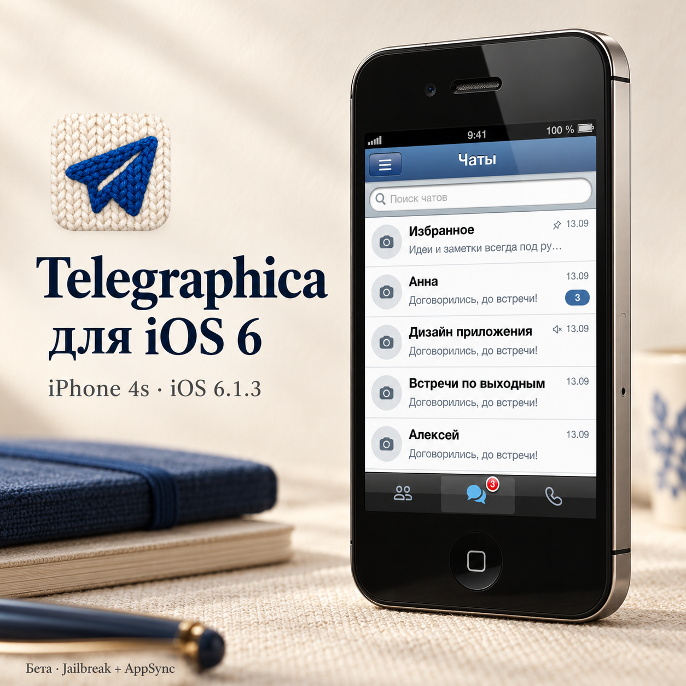
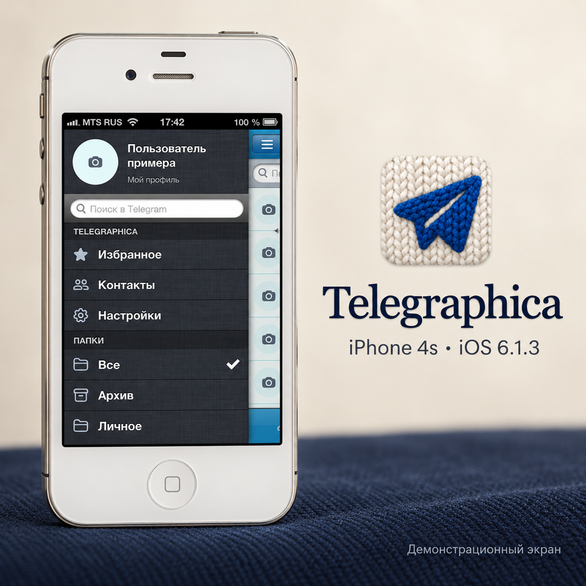
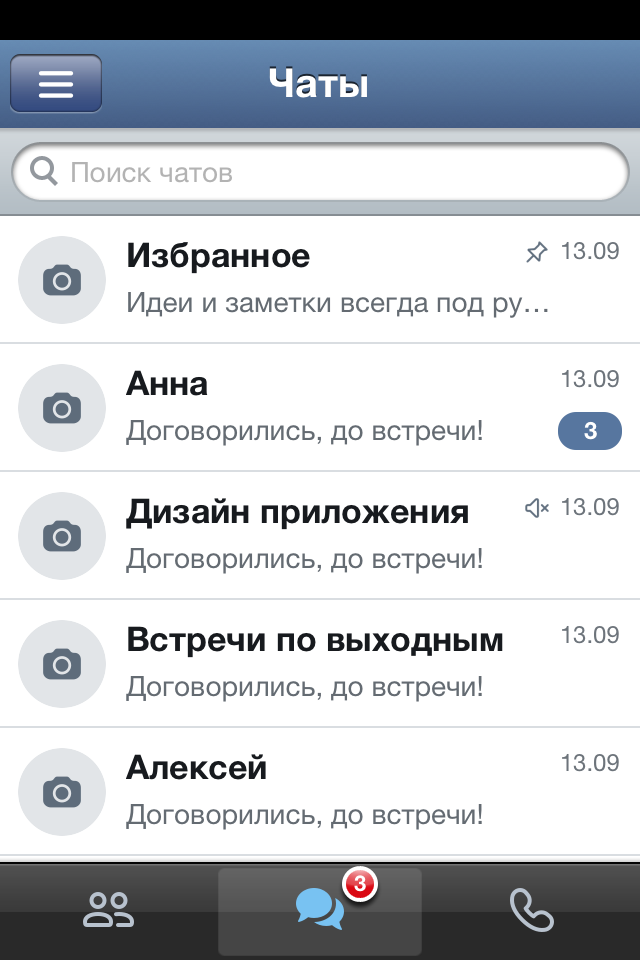
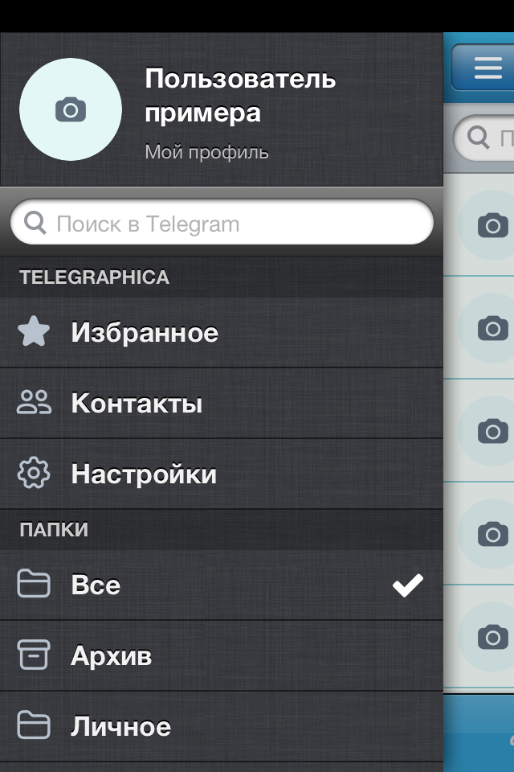
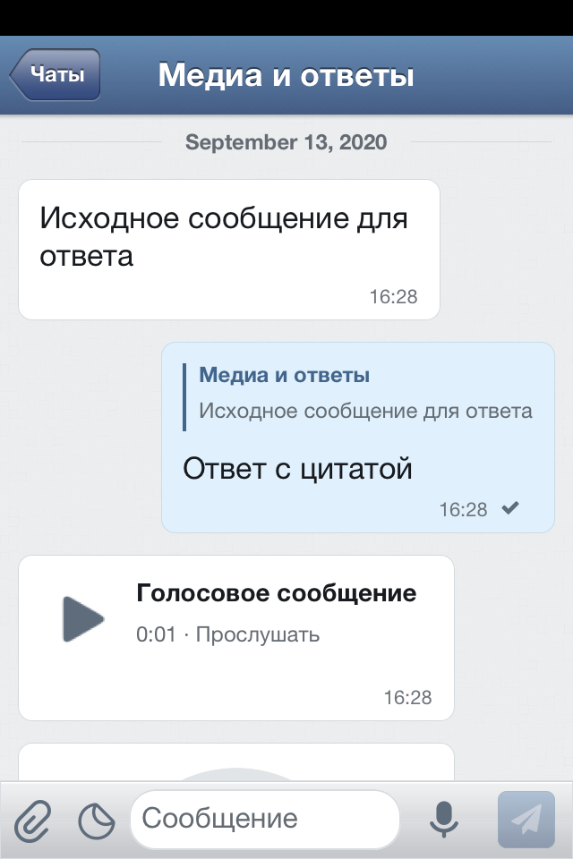
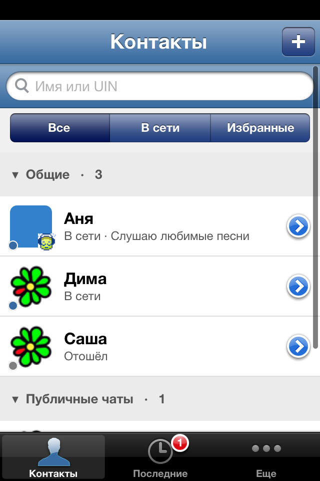
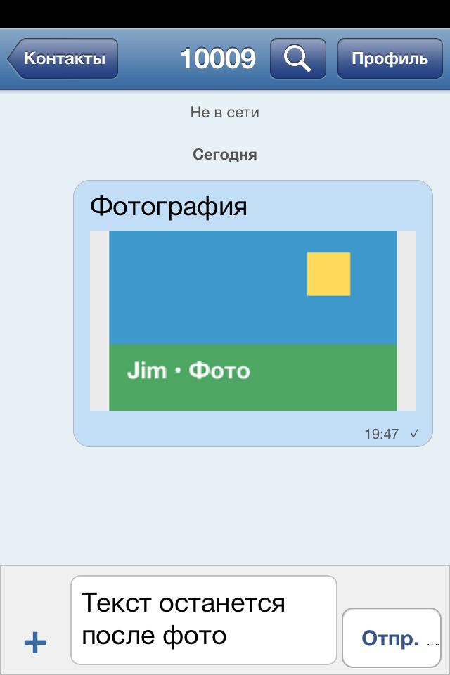

# MiChiRose — репозиторий Cydia

<p align="center">
  
</p>

**Telegraphica и Jim (ICQ) теперь в одном источнике Cydia.**

| Приложение | Что установить в Cydia | Совместимость и инструкция |
| --- | --- | --- |
| **Telegraphica — Telegram** | **Telegraphica** | [iOS 6 · установка](#install-telegraphica) |
| **Jim — ICQ / Jimm.online** | **Jim (iOS 6)** или **Jim (iOS 9)** | [iOS 6.1.3–6.1.6 / iOS 9.x · установка](https://michirose.github.io/cydia/depictions/jim/) |

Нужны jailbreak и совместимый AppSync Unified. Ниже — возможности и инструкции
по установке обоих приложений.


Личный репозиторий приложений, твиков и утилит для iOS с jailbreak.
В Cydia источник отображается как **MiChiRose**; совместимость и зависимости
определяются отдельно для каждого пакета.

**Адрес источника:** <https://michirose.github.io/cydia/>

[Telegraphica для iOS 6](#telegraphica-ios6) · [Jim Classic (ICQ)](#jim-ios) · [Как установить](#install-telegraphica) · [Как обновить из приложения](#update-telegraphica) · [Другие пакеты](#other-packages)

Если раньше был добавлен источник `/telegraphica-cydia/`, удалите старую запись
из списка источников Cydia и добавьте новый адрес выше. Удалять установленные
приложения и твики не нужно.

<a name="telegraphica-ios6"></a>

# Telegraphica для iOS 6

<p align="center">
  
</p>

**Telegram в духе классического iPhone.** Фактурные темы, привычная переписка и новая жизнь любимого устройства.

**Бета 1 · Сборка 53 · iOS 6 / ARMv7 · Jailbreak + AppSync**

[Первая установка](#install-telegraphica) · [Обновление из приложения](#update-telegraphica) · [Что умеет приложение](#возможности) · [IPA и загрузки](#ipa-и-другие-загрузки)

*Это рендер устройства с демонстрационным экраном приложения. Имена и переписка вымышлены; личные данные для иллюстраций не использовались.*

<a name="install-telegraphica"></a>

## Первая установка через Cydia

**Всё делается на iPhone. Терминал и компьютер не нужны.**

### 1. Проверьте требования

| Что нужно | Подробности |
| --- | --- |
| **iOS 6 и ARMv7** | Проверено на **iPhone 4s с iOS 6.1.3**. Другие устройства пока не прошли такую же проверку. |
| **Jailbreak и Cydia** | Обычная iOS без jailbreak этой сборкой не поддерживается. iOS 7 и новее не поддерживаются. |
| **AppSync Unified для iOS 6** | Если его ещё нет, сначала установите совместимую версию из доверенного источника Cydia. Здесь AppSync не распространяется; [проект AppSync](https://github.com/akemin-dayo/AppSync). |

### 2. Добавьте источник

Откройте **Cydia → Управление → Источники → Изменить → Добавить** и вставьте:

```text
https://michirose.github.io/cydia/
```

Дождитесь завершения обновления списка пакетов. Источник называется **MiChiRose**.

### 3. Установите полное приложение

В источнике **MiChiRose** выберите **Telegraphica → Установить → Подтвердить**.

**Telegraphica Background и Telegraphica Updater подтянутся автоматически:** первый отвечает за фоновые уведомления, второй — за обновления из приложения. Отдельная настройка служб не нужна. Выбирайте именно полное приложение **Telegraphica**.

Текущая версия полного пакета — **0.1.0~beta1-53**, службы Background — **0.1.0-25**, установщика Updater — **0.1.0-1**.

### 4. Войдите в свой аккаунт

Откройте Telegraphica с домашнего экрана. Для QR-входа:

1. В Telegraphica выберите **«Войти по QR-коду»**.
2. На другом устройстве откройте Telegram → **Настройки → Устройства → Подключить устройство**.
3. Отсканируйте код с экрана старого iPhone и завершите вход.

Каждый пользователь входит в свой аккаунт. Номера, коды входа и пароли никому присылать не нужно.


<details>
<summary><strong>Если источник пустой или установка не начинается</strong></summary>

- Убедитесь, что добавлен адрес **https://michirose.github.io/cydia/**, и дождитесь обновления источников.
- Если остался старый источник `/telegraphica-cydia/` или локальный адрес разработчика, удалите только старую запись источника, затем обновите список. Установленные пакеты и приложение удалять не нужно.
- Если Cydia сообщает об отсутствующем **AppSync Unified**, установите совместимую с iOS 6 версию из доверенного источника и повторите установку Telegraphica.
- При другой ошибке сохраните её точный текст и укажите модель, версию iOS и версию пакета. Не удаляйте данные аккаунта ради повторной попытки.

</details>

<a name="update-telegraphica"></a>

## Обновление прямо из приложения

**Для обычных обновлений больше не нужно каждый раз открывать Cydia.**

| Как установлено приложение | Что делать |
| --- | --- |
| **Сборка 46 или новее через Cydia** | Обновляйтесь из Telegraphica по шагам ниже: компонент Updater уже установлен. |
| **Сборка 45 или старше** | Один раз обновите полную Telegraphica через Cydia поверх текущей версии. Updater установится автоматически; следующие обычные обновления доступны из приложения. |
| **Только IPA, без пакета Updater** | Установите полный пакет Telegraphica из источника MiChiRose в Cydia. IPA сама не устанавливает компонент обновлений. |

### Скачать и установить новую версию

1. Откройте **Telegraphica → Настройки → Обновления**.
2. Нажмите **«Проверить обновления»**. Если появилось автоматическое предложение новой версии, можно сразу нажать **«Скачать»**.
3. Подтвердите загрузку и дождитесь окончания проверки файлов — на экране виден прогресс.
4. Нажмите **«Установить и закрыть»**. Приложение закроется для установки.
5. Подождите несколько секунд и снова откройте Telegraphica. В **Настройки → Обновления** проверьте установленный номер сборки.

> **Не удаляйте приложение перед обновлением.** Обновление ставится поверх текущего. Переходы **46 → 47 → 48** из приложения проверены владельцем на **iPhone 4s / iOS 6.1.3** с сохранением входа. Удаление иконки с домашнего экрана может удалить локальные данные.

### Как узнавать о новых версиях

Начиная со сборки **47**, автоматическая проверка работает при возвращении в приложение, если с предыдущей проверки прошло хотя бы **2 минуты**, и каждые **5 минут**, пока Telegraphica открыта. В сборке **46** интервал автоматической проверки — час; ручная кнопка позволяет проверить сразу.

В разделе **«Обновления»** видны номер установленной сборки, результат и время последней успешной проверки. Там же можно выключить **«Автопроверку»**. Ручная проверка остаётся доступной.

**«Отмена» скрывает только предложенную версию.** Следующую приложение предложит снова; пропущенную версию можно найти ручной проверкой. Загрузка и установка выполняются после вашего подтверждения.

### Если обновление не получилось

Сохраните текст ошибки и текущий номер сборки, закройте окно обновления и попробуйте ручную проверку ещё раз. Сохраняйте приложение и его данные. **Cydia остаётся доступным способом обновления:** можно установить полную Telegraphica поверх текущей версии из того же источника MiChiRose. Для обновления самого компонента Updater в будущем также может понадобиться Cydia.

## Возможности

- **Переписка:** личные диалоги, группы, папки и темы форумов.
- **Медиа:** фотографии, файлы, голосовые сообщения и видеокружки.
- **Общение:** ответы с цитатой, стикеры и обычные реакции.
- **Оформление:** классические темы и Aqua, вдохновлённые Telegraphica для Mac.
- **Уведомления:** jailbreak-служба принимает сообщения и при закрытом приложении. Длительный расход батареи ещё проверяется.

Telegraphica — неофициальный клиент Telegram. Это первая публичная бета; ограничения перечислены ниже.

<p align="center">
  
</p>

*Боковое меню на демонстрационном рендере. Ниже — экраны приложения с вымышленными данными.*

<table>
  <tr>
    <td align="center" width="33%"></td>
    <td align="center" width="33%"></td>
    <td align="center" width="33%"></td>
  </tr>
  <tr>
    <td align="center"><strong>Знакомые чаты</strong></td>
    <td align="center"><strong>Папки под рукой</strong></td>
    <td align="center"><strong>Больше, чем текст</strong></td>
  </tr>
</table>

<p align="center"><sub>Демонстрационные экраны с вымышленными данными. Личная переписка для иллюстраций не использовалась.</sub></p>

## IPA и другие загрузки

**Для обычной установки рекомендуем Cydia по шагам выше.**

| Скачать | Для чего |
| --- | --- |
| **[IPA для iOS 6](https://github.com/MiChiRose/cydia/releases/download/ios6-v0.1.0-beta1-53/Telegraphica-0.1.0-beta1-build53-ios6-armv7.ipa)** | Для совместимого jailbreak-установщика IPA с AppSync. |
| **[Все файлы релиза](https://github.com/MiChiRose/cydia/releases/tag/ios6-v0.1.0-beta1-53)** | Полный DEB, IPA, инструкция и контрольные суммы SHA-256. |

Загрузка IPA в Safari сама по себе **не устанавливает приложение**. IPA также не устанавливает фоновую службу и компонент обновлений автоматически: для полного комплекта используйте Cydia.

## Что нового в сборке 53

- Обновлён Telegram-протокол: исправлено отображение ранее неподдерживаемых опросов, в том числе с несколькими ответами и добавляемыми участниками вариантами.
- Варианты ответа доступны прямо в переписке; для нескольких ответов выбор подтверждается кнопкой голосования.
- События опросов, закрепления и вступления в группу оформлены как системные строки с именем участника, без пузыря сообщения.
- Кнопка ответов в обычной группе переводит к первому ответу в том же диалоге. Комментарии к постам канала в другой группе открываются отдельно.
- При первом запуске создаётся локальная защитная копия базы перед переходом на новое ядро. Подготовка может занять некоторое время; приложение не удаляйте.

Обновляйтесь поверх текущей версии через приложение или Cydia. Из-за обновления формата базы не устанавливайте старую сборку поверх новой. Данные аккаунта остаются на устройстве.

## Что пока ограничено

- Опросы с несколькими ответами и голосование подтверждены владельцем на iPhone 4s. Отправка по расписанию пока только для текста; её отдельная проверка на устройстве ещё предстоит. Карточки контактов и места предназначены для полученных сообщений.

- Настоящие аудио- и видеозвонки ещё не реализованы.
- Поиск музыки имеет известные проблемы; работоспособность конкретного прокси зависит от сервера и сети.
- Фоновые уведомления используют jailbreak-службу; длительный расход батареи ещё проверяется.
- Чистая установка на другом физическом устройстве и другие ARMv7-устройства пока не проверялись.
- iOS 7 и более новые системы этой бета-сборкой не поддерживаются.

## Ваш аккаунт остаётся вашим

В загрузках **нет чужой сессии, переписки, контактов, кэша и ключей базы данных**. Каждый пользователь самостоятельно входит в свой аккаунт. Конфигурация приложения получается по HTTPS; локальные конфигурационные файлы разработчика, ключи подписи и профили в пакеты не включены.

Исходники Telegraphica хранятся отдельно; на этой странице доступны описание, иллюстрации и установочные файлы.

<details>
<summary><strong>English installation guide</strong></summary>

Telegraphica is an unofficial Telegram client for **jailbroken iOS 6 / ARMv7** devices with a classic iPhone interface. Tested on **iPhone 4s / iOS 6.1.3**.

1. Install or make available **AppSync Unified compatible with iOS 6** from your trusted package source.
2. Open **Cydia → Manage → Sources → Edit → Add**.
3. Add **https://michirose.github.io/cydia/** and refresh.
4. Install **Telegraphica**, the full application. The companion installs automatically; no terminal or development Mac is needed.
5. Open the app and sign in to your own Telegram account. For QR login, open Telegram on another device → Settings → Devices → Link Desktop Device, then scan the code displayed by Telegraphica.

The [IPA](https://github.com/MiChiRose/cydia/releases/download/ios6-v0.1.0-beta1-53/Telegraphica-0.1.0-beta1-build53-ios6-armv7.ipa) requires a compatible jailbreak IPA installer with AppSync. Downloading it in Safari alone does not install it. Stock iOS is unsupported.

For build 46 or newer installed through Cydia, open **Settings → Updates → Check for updates**, download, confirm **Install and Close**, wait a few seconds and reopen Telegraphica. Build 45 or earlier, or an IPA-only installation without Updater, first needs the full Cydia package. See the [in-app update guide](#update-telegraphica). Do not delete the existing app. The owner tested 46 → 47 → 48 on iPhone 4s / iOS 6.1.3 with login preserved. Real calls are not implemented, Music search has known issues, and background battery behavior remains experimental.

</details>

<details>
<summary><strong>Контрольные суммы и обратная связь</strong></summary>

`SHA256SUMS` в [релизе](https://github.com/MiChiRose/cydia/releases/tag/ios6-v0.1.0-beta1-53) проверяет установочные файлы. [SHA256SUMS источника](https://michirose.github.io/cydia/SHA256SUMS) относится к странице, индексам Cydia и сохранённым загрузкам. Индексы пока без отдельной подписи APT; используйте HTTPS без отключения проверки сертификатов.

Чтобы сообщить о проблеме, укажите сборку, модель устройства, версию iOS, шаги воспроизведения и текст ошибки. Не отправляйте переписку, номера телефонов, коды входа или пароли.

</details>


---

<a name="jim-ios"></a>

# Jim Classic — ICQ для старых iPhone

<p align="center">
  
</p>

**Знакомая аська на классическом iPhone.** Контакты, сообщения, фотографии,
смайлики и X-статусы — в нативном интерфейсе с темами ICQ, QIP и Jimm.

**Сборка 17 · пакет 0.1.0-17 · iOS 6.1.3–6.1.6 и iOS 9.x · ARMv7 · Jailbreak + AppSync**

Jim Classic — полноценное самостоятельное приложение для общения в сети **Jimm.online**.
Оно устанавливается на домашний экран и работает напрямую с сервисом, без
браузерной оболочки. Это независимый клиент, а не официальное приложение ICQ.

[Установить Jim](#install-jim) · [Возможности](#jim-features) · [Фотографии](#jim-photos) · [Обновление](#update-jim) · [Загрузки](https://github.com/MiChiRose/Jim-iOS/releases)

<a name="install-jim"></a>

## Установка Jim через Cydia

**Для новой установки достаточно самого iPhone. Компьютер и терминал не нужны.**

### 1. Проверьте совместимость

| Что нужно | Подробности |
| --- | --- |
| **iPhone с ARMv7** | Приложение разработано для iPhone 4S. Вход и текстовая переписка подтверждены на iPhone 4S с iOS 6.1.3. |
| **iOS 6.1.3–6.1.6 или iOS 9.x** | В Cydia есть отдельный пакет для каждой системы. iOS 7 и 8 этими пакетами не поддерживаются. |
| **Jailbreak и Cydia** | Установка на обычную iOS без jailbreak не поддерживается. |
| **AppSync Unified** | Установите версию, совместимую с вашей iOS, из доверенного источника. В нашем источнике AppSync не распространяется. |

### 2. Добавьте источник MiChiRose

Откройте **Cydia → Управление → Источники → Изменить → Добавить**:

```text
https://michirose.github.io/cydia/
```

Если источник уже добавлен для Telegraphica, достаточно обновить список пакетов.

### 3. Выберите пакет для своей iOS

| Ваша система | Пакет в Cydia |
| --- | --- |
| iOS 6.1.3–6.1.6 | **Jim (iOS 6)** |
| iOS 9.x | **Jim (iOS 9)** |

Нажмите **«Установить → Подтвердить»**, дождитесь окончания установки и откройте
**Jim** с домашнего экрана. Одновременно устанавливать оба пакета не нужно.

### 4. Войдите в Jimm.online

Введите **свой UIN и пароль Jimm.online**. Каждый пользователь входит в собственный
аккаунт. При выборе «Запомнить вход» токен сохраняется в Связке ключей; пароль
не записывается на диск. Контакты и доступные сообщения загрузятся после входа.

<details>
<summary><strong>Если Jim уже установлен через USB или IPA</strong></summary>

Пакет Cydia использует другое место установки. Перенос данных между этими
способами ещё не реализован, поэтому установщик останавливается при обнаружении
USB/IPA-копии. Сохраните существующий Jim и его историю; не удаляйте приложение
ради обхода проверки. Это ограничение перехода, а не требование для новых пользователей.

</details>

<a name="jim-features"></a>

## Новое в сборке 17

В настройках Jim появилась кнопка «Проверить обновления». Она показывает доступную версию и позволяет скачать и установить её после отдельного подтверждения.

Проверка версии подтвердилась на iPhone 4S с iOS 6.1.3. Первый полный цикл установки из Jim ещё предстоит проверить на устройстве.

## Возможности Jim

- **Переписка:** отправка и получение сообщений, состояния отправки, цитирование,
  копирование текста и индикатор набора. «Принято сервером» означает приём
  сообщения сервером, а не прочтение собеседником.
- **История:** локальное сохранение, поиск по переписке с переходом к найденному
  сообщению, загрузка ранней истории и кнопка перехода к новым сообщениям.
- **Удобный ввод:** многострочное поле, сохранение черновиков и палитра смайликов.
- **Контакты:** поиск, добавление по UIN, избранные, группы и фильтры; переименование,
  перенос между группами, удаление из списка, блокировка и разблокировка.
- **Профиль:** аватары контактов и выбор собственного аватара, сетевые статусы,
  X-статусы с подписью.
- **Фотографии:** выбор из фототеки или камеры, предпросмотр перед отправкой,
  карточки в чате и просмотр с увеличением.
- **Оформление:** темы ICQ, QIP и Jimm, знакомые смайлики и настройка размера текста.
- **Оповещения:** звук, вибрация, непрочитанные и тихие чаты при работе приложения.
- **Связь:** восстановление соединения при возврате в приложение; сохранённая
  история и черновики доступны без сети. Повтор неподтверждённой отправки — вручную.
- **Ссылки:** открытие обычных адресов в Safari и копирование полного URL.

<table>
  <tr>
    <td align="center" width="50%"></td>
    <td align="center" width="50%"></td>
  </tr>
  <tr><td align="center"><strong>Контакты и статусы</strong></td><td align="center"><strong>Переписка и фотографии</strong></td></tr>
</table>

*Снимки интерфейса из iOS 6 Simulator. Контакты, сообщения и фотографии демонстрационные.*

<a name="jim-photos"></a>

## Как отправить фотографию

1. Откройте чат и нажмите **«+»** слева от поля ввода.
2. Выберите **«Фототека»** или **«Камера»**.
3. Проверьте снимок и получателя на экране предпросмотра.
4. Нажмите **«Отправить»**. Уже набранный текст останется в черновике.

Нажмите карточку фото в чате, чтобы открыть его. Увеличение работает щипком
и двойным нажатием. Загрузку можно отменить; после ошибки доступен ручной повтор.

При первом использовании фотосервис может отдельно попросить пароль аккаунта
прямо на телефоне. Пароль не сохраняется. Снимок уменьшается до 1280 пикселей
по большей стороне; исходные метаданные, включая GPS, не переносятся в JPEG.
Доступность фотографии зависит от фотосервиса Jimm.online.

<a name="update-jim"></a>

## Обновление Jim

Текущая версия пакета — **0.1.0-17 (сборка 17)**. Если у вас уже установлен
Jim из Cydia, обновите источники и установите сборку 17 поверх текущей.

При установке сборки 17 через Cydia вместе с Jim устанавливается помощник Jim Updater. Для следующих версий откройте «Настройки → Подключение и помощь → Проверить обновления».
Скачайте найденное обновление и подтвердите «Установить и закрыть Jim».
После завершения установки снова откройте приложение.

Копию, установленную через USB или IPA, обновляйте тем же способом.

[Страница Jim и установка](https://michirose.github.io/cydia/depictions/jim/) ·
[Загрузки на GitHub](https://github.com/MiChiRose/Jim-iOS/releases)

## Совместимость и доступные функции

Jim работает с Jimm.online. Фоновый приём при закрытом приложении, голосовые
сообщения, видео и звонки не реализованы. iOS 9, другие модели iPhone, чистая
установка из Cydia и живой обмен фотографиями ещё не прошли ту же проверку на
физическом устройстве, что вход и текстовая переписка на iPhone 4S / iOS 6.1.3.

## Ваши данные

В установочных файлах нет чужого аккаунта, переписки, паролей и личных снимков.
История и черновики сохраняются на телефоне с разделением аккаунтов. Токены
входа хранятся в Связке ключей, если включено запоминание входа. Удаление пакета
Cydia не выполняет отдельную очистку истории или токенов.

При проблеме укажите **модель iPhone, версию iOS, сборку и точный текст ошибки**.
Если Cydia остановилась на загрузке зависимости, например Core Utilities,
важно записать название пакета и адрес источника из ошибки: это отдельный этап
до установки Jim. Не публикуйте пароли, токены и личную переписку.

---

<a name="other-packages"></a>

## Доступные пакеты

- **[Jim Classic — ICQ для старых iPhone](#jim-ios)** — нативный клиент Jimm.online для iOS 6 и iOS 9: сообщения, история, контакты, фотографии, смайлики и X-статусы.

- **Cellular Data in Settings** — переключатель «Сотовые данные» сразу под Bluetooth
  на главном экране «Настроек» iPhone с iOS 6.1.3. После установки закройте
  «Настройки» через меню недавних приложений и откройте снова.
  [Исходники](cellular-data-settings-source-0.1.0-beta1.tar.gz).

- **[AirPods Fix (Alpha)](https://michirose.github.io/cydia/depictions/airpods/)** —
  экспериментальное исправление звука на iPhone 4s/5 / iOS 6.1.3.
  Alpha 5 использует способ iOS 6 Pods Hack от ASentientBot: запуск встроенного
  потока тишины по подключению Bluetooth и перекрытие клипов без сброса при смене
  песни. Код и аудио подготовлены независимо. Убраны принудительное управление
  аудиосессией и команды выбора выхода. Оригинал помог по отзыву владельца;
  наша сборка пока требует проверки на физическом iPhone. Установка — через
  Cydia с удалением конфликтующего исправления и перезагрузкой.

- **[Weather Fix (Alpha)](https://michirose.github.io/cydia/depictions/weather/)** —
  экспериментальное исправление штатной «Погоды» на iOS 6 с прямым доступом
  к Open-Meteo. Alpha 9 исправляет запуск обновления жестом вниз за название города и показывает подтверждённый результат. Непостоянная ошибка Weather Unavailable ещё исследуется.
  Дополнительного приложения и новой иконки нет. Обрабатывается и оставшийся после WeatherX адрес сервиса.
  На iPhone 4s / iOS 6.1.3 подтверждена корректная погода в штатной **Local Weather**
  без ручного добавления города. Современный TLS работает внутри пакета;
  настройки GPS и список городов не меняются. Перед установкой удалить WeatherX.
- **Telegraphica** — неофициальный клиент Telegram для iOS 6 / ARMv7.
- **Telegraphica Background** — фоновая служба, устанавливаемая вместе с Telegraphica.

Новые твики и утилиты будут добавляться в этот же источник.

## Содержание текущей ветки

Здесь остаются только пакеты из `Packages`, соответствующие исходники твиков
и актуальная IPA. Старые сборки доступны в истории Git.
Перед публикацией выполнить `python3 scripts/maintain_repo.py --prune`:
команда проверяет пакеты и ссылки, удаляет прежние сборки, обновляет индексы
и контрольные суммы.
